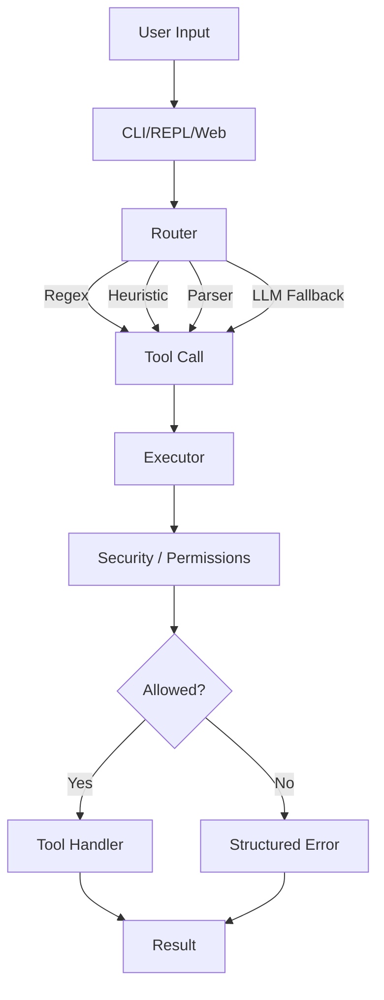

# Personal Assistant - Architecture Documentation

## Overview

This is a **local-first CLI assistant** that routes natural language commands to tools with optional LLM fallback. The system prioritizes security, performance, and maintainability through a multi-stage routing strategy and fail-closed security model.

## Request Flow




## Core Principles (Invariants)

These are the "rules of the universe" for the codebase:

1. **Executor is the single security choke point** - All tool execution goes through executor, which enforces permissions, validation, and capabilities.

2. **Tools must only use context.paths and context.commands** - Tools never access raw `fs` or `child_process`. All operations go through capability-based APIs.

3. **All tool boundaries validated by Zod** - Every tool argument is validated against a Zod schema before execution.

4. **Storage writes are atomic; logs are append-only** - JSONL writes use atomic rename operations. Audit logs are append-only for integrity.

5. **Router may propose tools, Executor is authoritative** - Router can suggest tools, but executor enforces the final security decision.

## End-to-End Lifecycle

### 1. Initialization

```
CLI Entry Point (cli.ts)
  ↓
Load Config (file + env vars)
  ↓
Build Runtime (runtime.ts)
  ├─ Create Tool Registry (loads built-in + plugins)
  ├─ Create Executor (with security enforcement)
  ├─ Create LLM Provider (if API keys configured)
  └─ Resolve Storage Paths
```

### 2. Command Routing

```
User Input → Router (router.ts)
  ↓
Multi-Stage Routing:
  1. Regex Fast Paths (pre-compiled patterns)
     → Returns tool_call immediately (no LLM)
  2. Heuristic Parser (pattern matching)
     → Returns tool_call if pattern matches
  3. Task/Memory Parsers (NLP patterns)
     → Returns tool_call for structured commands
  4. LLM Fallback (if provider available)
     → Returns tool_call or reply
  ↓
Router Result:
  - RouteToolCall { tool_call, _debug }
  - RouteReply { reply, _debug }
  - RouteError { error, code }
```

### 3. Tool Execution

```
Router Result → Executor (executor.ts)
  ↓
Security Checks (in order):
  1. Agent Toolset Check
     - System agent (kind='system'): full access
     - Other agents: check tools allowlist
     - No agent: only SAFE_TOOLS allowed
  2. Global Deny List
     - Check permissions.deny_tools
  3. Schema Validation
     - Validate args against Zod schema
  4. Build ExecutorContext
     - Inject capabilities (paths, commands)
     - Provide storage accessors
  ↓
Execute Tool Handler
  ↓
Audit Logging (if enabled)
  ↓
Return ToolResult { ok, result, error, _debug }
```

### 4. Tool Execution Context

Tools receive an `ExecutorContext` with:

- **Capabilities**: `paths.resolveAllowed()`, `commands.runAllowed()`
- **Storage**: `readJsonl()`, `writeJsonl()`, `appendJsonl()`
- **Memory**: `readMemory()`, `writeMemory()`
- **Helpers**: `scoreEntry()`, `sortByScoreAndRecency()`
- **Permissions**: `permissions`, `limits`, `requiresConfirmation()`

Tools **never** access raw filesystem or shell directly.

## Security Model

| Layer | What It Blocks | Example |
|-------|---------------|---------|
| **Router** (optional) | Convenience allowlist | "Don't propose tools outside agent toolset" |
| **Executor** (authoritative) | Tool use + args | "No-agent can't write files" |
| **Path Capabilities** | Traversal + sensitive dirs | `.git`, `.env`, `node_modules` blocked |
| **Command Capabilities** | Shell execution | Only allowlisted commands (`ls`, `pwd`, `cat`, `du`) |

### Security Layers Explained

1. **Router Permission Checks**: Router checks agent toolset before proposing tools. When agent is undefined, only `SAFE_TOOLS` are proposed (matches executor behavior).

2. **Executor Agent Checks**: 
   - `kind='system'`: Full access (trusted, created by runtime)
   - Other agents: Explicit tool allowlist
   - No agent: Only `SAFE_TOOLS` allowed

3. **Path Validation**: 
   - All paths resolved relative to `baseDir`
   - No `..` traversal allowed
   - Canonical paths checked (prevents symlink attacks)
   - Hardcoded blocks: `.git`, `.env`, `node_modules`

4. **Command Allowlist**: Only commands in `permissions.allow_commands` can execute. Flags validated per-command.

## Command Examples

### Example 1: Memory Storage
```bash
assistant remember "I parked on level 3"
```

**Router Result**:
```json
{
  "version": 1,
  "mode": "tool_call",
  "tool_call": {
    "tool_name": "remember",
    "args": { "text": "I parked on level 3" }
  },
  "_debug": {
    "path": "regex_fast_path",
    "duration_ms": 0.5
  }
}
```

**Executor Result**:
```json
{
  "ok": true,
  "result": { "count": 42 }
}
```

### Example 2: Memory Recall
```bash
assistant recall "parked"
```

**Router Result**: `tool_call` for `recall` tool  
**Executor Result**: Returns matching memory entries sorted by relevance

### Example 3: File Write
```bash
assistant write notes/today.md "Meeting notes..."
```

**Router Result**: `tool_call` for `write_file`  
**Executor Result**: 
- Validates path is in `allow_paths`
- Checks file size limits
- Writes atomically

### Example 4: File Read
```bash
assistant read notes/today.md
```

**Router Result**: `tool_call` for `read_file`  
**Executor Result**: Returns file content (up to `maxReadSize` limit)

### Example 5: Git Status
```bash
assistant git status
```

**Router Result**: `tool_call` for `git_status` (regex fast path)  
**Executor Result**: Returns git working tree status

### Example 6: Shell Command
```bash
assistant run npm test
```

**Router Result**: `tool_call` for `run_cmd`  
**Executor Result**: 
- Validates command is in `allow_commands`
- Executes in sandboxed context
- Returns stdout/stderr

## Architecture Components

### Router (`app/router.ts`)

Multi-stage routing strategy:

1. **Regex Fast Paths**: Pre-compiled patterns for common commands
   - `remember: <text>` → `remember` tool
   - `recall: <query>` → `recall` tool
   - `git status` → `git_status` tool
   - Fast, no LLM needed

2. **Heuristic Parser**: Pattern matching for structured commands
   - "add task X" → `task_add`
   - "list tasks" → `task_list`

3. **Task/Memory Parsers**: NLP-based parsing
   - Natural language task commands
   - Memory queries

4. **LLM Fallback**: Uses provider when patterns don't match
   - Filters tools by agent permissions
   - Returns `tool_call` or conversational `reply`

### Executor (`core/executor.ts`)

Security enforcement and tool execution:

- **Agent Permissions**: Checks `agent.tools` allowlist (or `kind='system'` for full access)
- **Deny List**: Blocks tools in `permissions.deny_tools`
- **Schema Validation**: Validates args with Zod schemas
- **Path Capabilities**: Provides `paths.resolveAllowed()` for file operations
- **Command Capabilities**: Provides `commands.runAllowed()` for shell commands
- **Audit Logging**: Records all tool executions

### Storage (`storage/jsonl.ts`)

Local-first persistence:

- **Atomic Writes**: Write to temp file, then rename (cross-platform safe)
- **Corruption Handling**: Quarantines corrupt lines to `.corrupt` file
- **Append-Only Logs**: Audit trails use append-only writes

### Runtime (`runtime/runtime.ts`)

Dependency injection composition root:

- **Single Wiring Point**: All dependencies created here
- **Testable**: Easy to mock for tests
- **Flexible**: Options for customization (paths, agents, providers)

## Known Limitations & Footguns

### 1. Router/Executor Alignment

**Issue**: Router may propose tools that executor will deny when agent is undefined.

**Status**: ✅ **Fixed** - Router now only proposes `SAFE_TOOLS` when agent is undefined, matching executor behavior.

**Documentation**: Router comments explicitly state "Router may propose tools, Executor is authoritative."

### 2. System Agent Trust

**Issue**: Previously checked `agent.name === 'System'` (string comparison, spoofable).

**Status**: ✅ **Fixed** - Now uses `agent.kind === 'system'` enum check. Only runtime-created agents can have `kind='system'`.

### 3. Atomic Write Edge Cases

**Issue**: `fs.renameSync()` can fail if directory doesn't exist or on Windows edge cases.

**Status**: ✅ **Fixed** - Directory creation added, temp file in same directory for cross-platform safety.

### 4. Plugin Schema Validation

**Issue**: Plugin schema conversion failures were silent.

**Status**: ✅ **Fixed** - Warnings logged when schema conversion fails. Tool still loads but without validation.

## Performance Optimizations

1. **Regex Fast Paths**: Common commands skip LLM entirely
2. **Heuristic Parser**: Pattern matching before LLM fallback
3. **LLM Caching**: Responses cached via `FileCache`
4. **Test Caching**: Test results cached to skip unchanged tests

## Extension Points

### Adding a New Tool

1. **Define Schema** (`src/core/types.ts`):
   ```typescript
   export const MyToolSchema = z.object({
       arg: z.string().min(1),
   });
   export type MyToolArgs = z.infer<typeof MyToolSchema>;
   ```

2. **Implement Handler** (`src/tools/my_tool.ts`):
   ```typescript
   export function handleMyTool(args: MyToolArgs, context: ExecutorContext): ToolResult {
       // Use context.paths, context.commands, etc.
       return { ok: true, result: {...} };
   }
   ```

3. **Register** (`src/core/tool_registry.ts`):
   - Add to `TOOL_HANDLERS` map
   - Add schema to `ToolSchemas` in `types.ts`

4. **Add to Agent** (`src/agents/index.ts`):
   - Add tool name to agent's `tools` array

### Plugin System

Plugins can extend functionality without modifying core:

- Location: `~/.assistant/plugins/`
- Format: CommonJS module with `manifest.json`
- Tools: Plugins can add new tools (lower priority than built-in)
- Schemas: Converted from `ToolSpec` to Zod (with warnings on failure)

See `docs/PLUGINS.md` for details.

## Debugging

### Explain Mode (Planned)

A command like:
```bash
assistant explain "write foo.txt: hi"
```

Would return:
- Which stage matched (regex/heuristic/parser/LLM)
- What tool would be called
- Whether it would be allowed under current permissions
- Estimated execution path

### Verbose Mode

Use `--verbose` flag to see:
- Routing decisions
- Agent context
- Tool filtering
- LLM usage

### Audit Trail

All tool executions logged to `${ASSISTANT_DATA_DIR}/audit.jsonl` (or `{project}/data/audit.jsonl` when running from source):
```json
{
  "ts": "2024-01-01T12:00:00Z",
  "tool": "write_file",
  "args": {"path": "notes.md", "content": "..."},
  "ok": true,
  "duration_ms": 15.2
}
```

## Testing Strategy

- **Unit Tests**: Colocated `*.test.ts` files
- **Integration Tests**: End-to-end CLI tests
- **Security Tests**: Path traversal, command injection
- **Performance Tests**: Routing benchmarks

See `docs/TESTING.md` for details.

## Related Documentation

- **Security**: `docs/SECURITY.md` - Detailed security model
- **Configuration**: `docs/CONFIGURATION.md` - Config options
- **Commands**: `docs/COMMANDS.md` - CLI reference
- **Plugins**: `docs/PLUGINS.md` - Plugin development
- **Testing**: `docs/TESTING.md` - Test patterns

